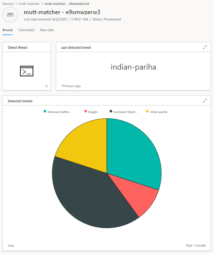
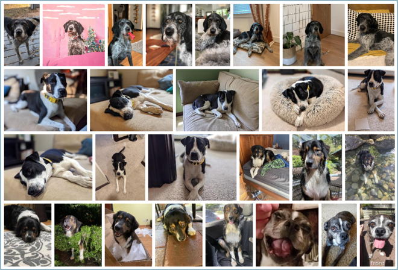
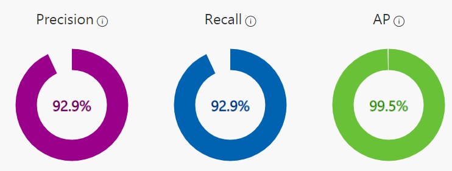
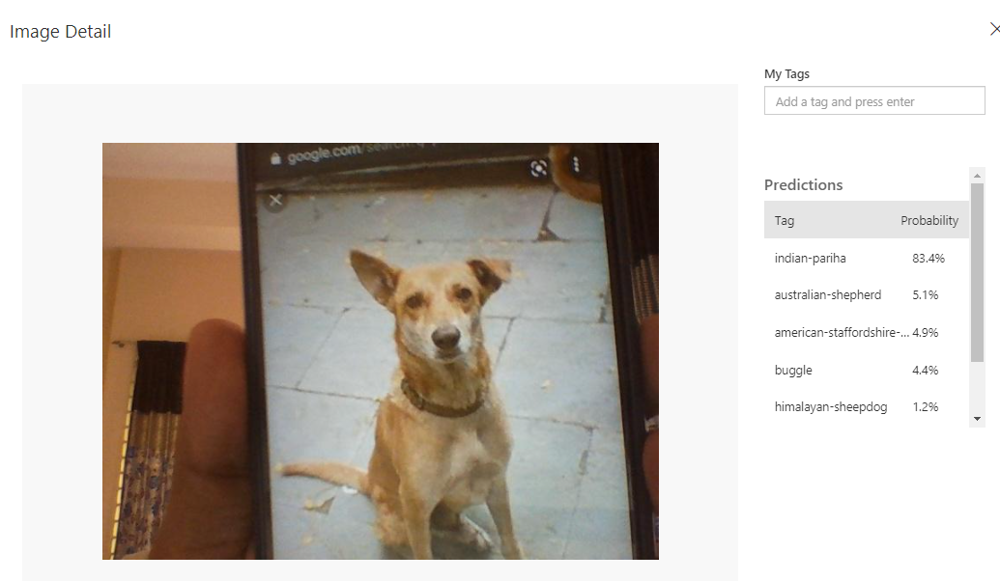
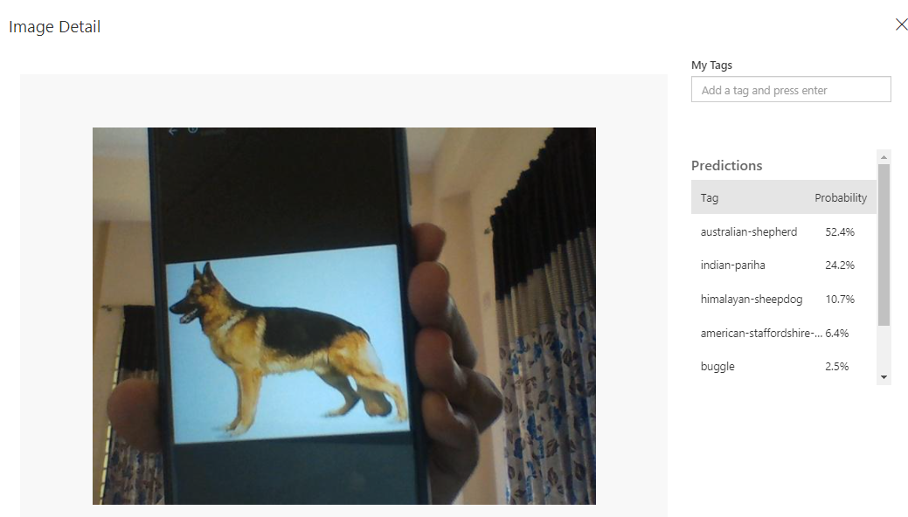

# The Mutt Matcher (IoT version)

According to the World Health Organization there are more than 200 million stray dogs worldwide. The American Society for the Prevention of Cruelty to Animals estimates over 3 million dogs enter their shelters annually - about 6 dogs per minute! Anything that can reduce the time and effort to take in strays can potentially help millions of dogs every year.

Different breeds have different needs, or react differently to people, so when a stray or lost dog is found, identifying the breed can be a great help.
This device will help workers and volunteers to be able to quickly detect the breed and make decisions on the best way to approach and care for the dog.

We can keep [a set of images](./model-images) for a range of dog breeds to train the ML model using a service called **Custom Vision**.

## Instructions 

Detalied instructions are available on the [original repository](https://github.com/jimbobbennett/mutt-matcher-iot) prepared by [Jim Bennet](https://github.com/jimbobbennett/)

## Model and Results

Considering the image quality precision and quantity of data provided, the performance of the model :

📑 And when showed images of an **Indian Pariah** and **German Shepherd (Not Available in the Training Model)** , the results came out as :

### Learn more

You can learn more about using Custom Vision to train image classifiers and object detectors using the following resources:

- [Custom Vision documentation](https://docs.microsoft.com/azure/cognitive-services/custom-vision-service/?WT.mc_id=academic-36256-jabenn)

- [Custom Vision modules on Microsoft Learn, a free, hands-on, self-guided learning platform](https://docs.microsoft.com/users/jimbobbennett/collections/qe2ehjny7z7zgd?WT.mc_id=academic-36256-jabenn)

You can learn more about Azure IoT Central using the following resources:

- [IoT Central documentation](https://docs.microsoft.com/azure/iot-central/?WT.mc_id=academic-36256-jabenn)

- [IoT Central modules on Microsoft Learn, a free, hands-on, self-guided learning platform](https://docs.microsoft.com/users/jimbobbennett/collections/o5w5c3eyre61x7?WT.mc_id=academic-36256-jabenn)

If you enjoy working with IoT, you can learn more using the following resource:

- [IoT for beginners, a 24-lesson curriculum all about IoT basics](https://github.com/microsoft/IoT-For-Beginners)
